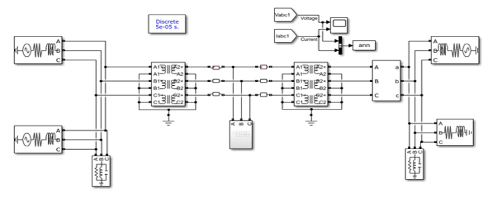
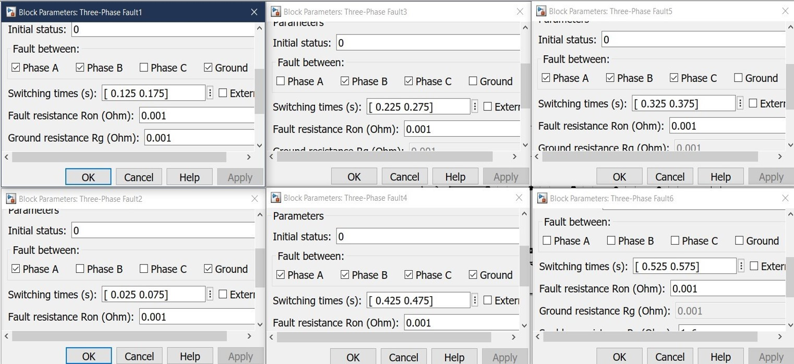
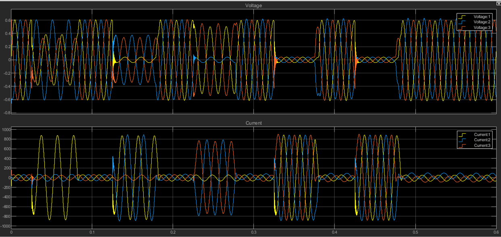

==============================================
Data Acquisition from a MATLAB Simulink Model
==============================================

Overview
========

The success of any machine learning-based fault detection system heavily depends on the quality and comprehensiveness of the training data. For PowerAI, we utilized advanced MATLAB Simulink simulation to generate a robust dataset of three-phase power system behaviors under both normal and fault conditions. This approach allows us to create controlled, labeled datasets that would be extremely difficult and dangerous to obtain from real power systems.

Power System Model Architecture
===============================

Model Source and Attribution
----------------------------

**Important Note:** The Simulink power system model used in this project was sourced from an open-source GitHub repository rather than developed from scratch. This approach allowed us to leverage existing, validated power system models and focus our efforts on the AI development aspects of the project.

**Model Source:** 
   * **Repository:** https://github.com/KingArthur000/Electrical-Fault-detection-and-classification
   * **Original Author:** KingArthur000
   * **Modifications:** Adapted for our specific fault simulation requirements

System Configuration
---------------------

The power system model represents a realistic transmission network with the following key components:

**Power Generation:**
   * **4 Generators:** Each rated at 11 × 10³ V (11 kV)
   * **Configuration:** Two generator pairs positioned at opposite ends of the transmission line
   * **Generation Capacity:** Designed to simulate realistic power generation scenarios

**Transmission Infrastructure:**
   * **Transmission Line:** High-voltage power transmission line connecting generation sources
   * **Transformers:** Step-up and step-down transformers positioned between generators and transmission line
   * **Fault Location:** Midpoint of the transmission line selected as the primary fault injection point

**Measurement Points:**
   * **Line Voltages:** Three-phase voltage measurements (VR, VS, VT)
   * **Line Currents:** Three-phase current measurements (IR, IS, IT)
   * **Sampling Location:** Output side of the power system for comprehensive signal capture

Fault Simulation Strategy
=========================

Comprehensive Fault Coverage
-----------------------------

To ensure our AI model can detect and classify various types of electrical faults, we systematically simulated multiple fault scenarios that commonly occur in real power systems.

**Fault Types Simulated:**

**Single-Phase Faults:**
   * **Line-to-Ground (LG) Faults:** Phase R-Ground, Phase S-Ground, Phase T-Ground
   * **Characteristics:** Most common type of fault in power systems (~80% of all faults)
   * **Simulation Parameters:** Variable fault resistance and inception angles

**Multi-Phase Faults:**
   * **Line-to-Line (LL) Faults:** RS, ST, TR phase combinations
   * **Line-to-Line-to-Ground (LLG) Faults:** Two-phase faults with ground connection
   * **Three-Phase (LLL) Faults:** Balanced and unbalanced three-phase faults
   * **Three-Phase-to-Ground (LLLG) Faults:** Most severe fault condition

**Example: Line-to-Ground (LG) Fault Analysis**

.. image:: _static/example_lg.png
   :alt: Example of LG Fault Simulation
   :align: center
   :width: 600px

The above figure demonstrates a typical Line-to-Ground fault simulation showing the characteristic voltage and current waveforms during fault inception and clearing.

Fault Parameter Variations
---------------------------

To create a comprehensive dataset that represents real-world conditions, each fault type was simulated with various parameters:

**Fault Inception Time:**
   * **Range:** 0.1s to 0.9s within the simulation cycle
   * **Purpose:** Capture fault behavior at different points in the AC waveform
   * **Variations:** Multiple inception times for each fault type

**Fault Resistance:**
   * **Low Resistance Faults:** 0.01Ω - 1Ω (solid faults)
   * **Medium Resistance Faults:** 1Ω - 10Ω (arc faults)
   * **High Resistance Faults:** 10Ω - 100Ω (incipient faults)

**Fault Duration:**
   * **Temporary Faults:** 0.1s - 0.5s
   * **Permanent Faults:** 0.5s - 2.0s
   * **Clearing Time:** Variable based on protection system response

**Switching Time Analysis**

The switching time analysis shows the precise timing of fault inception and clearing for different fault scenarios, which is crucial for training the AI model to recognize transient behaviors.

Data Collection and Processing
==============================

Simulation Execution
--------------------

**Simulation Parameters:**
   * **Total Simulation Time:** 5.0 seconds per scenario
   * **Sampling Rate:** 20 kHz (20,000 samples per second)
   * **Time Step:** 50 microseconds

**Data Points Generated:**
   * **Approximately 100,000 data points** collected across all simulation scenarios
   * **6 Signal Channels:** IR, IS, IT, VR, VS, VT for each data point
   * **Temporal Resolution:** High-frequency sampling to capture transient phenomena

Data Structure and Organization
-------------------------------

**Raw Data Format:**
   * **File Format:** MATLAB .mat files and CSV exports
   * **Signal Organization:** Time-series data for each of the 6 electrical parameters
   * **Metadata:** Fault type, inception time, resistance, duration for each scenario

**Data Labeling Strategy:**

**Normal Operation:**
   * **Conditions:** Balanced load, steady-state operation
   * **Duration:** Full simulation periods without fault injection

**Fault Conditions:**
   * **LG Faults:** (R-G, S-G, T-G respectively)
   * **LL Faults:** (RS, ST, TR respectively)  
   * **LLG Faults:** (RSG, STG, TRG respectively)
   * **LLL Faults:** (Three-phase fault)
   * **LLLG Faults:** (Three-phase-to-ground fault)

Quality Assurance and Validation
=================================

Data Integrity Checks
----------------------

**Signal Validation:**
   * **Physical Constraints:** Verification that voltage and current values remain within realistic bounds
   * **Energy Conservation:** Ensuring power balance equations are satisfied
   * **Frequency Domain Analysis:** FFT analysis to verify signal characteristics

**Simulation Accuracy:**
   * **Model Verification:** Comparison with established power system analysis results
   * **Fault Behavior Validation:** Ensuring simulated faults exhibit expected electrical characteristics
   * **Transient Analysis:** Verification of fault inception and clearing transients

Dataset Characteristics
-----------------------

**Data Distribution:**
   * **Normal Conditions:** ~50% of total dataset
   * **Single-phase Faults:** ~30% of total dataset (reflecting real-world frequency)
   * **Multi-phase Faults:** ~20% of total dataset
   * **Balanced Distribution:** Ensuring adequate representation of each fault type

**Signal Quality:**
   * **High Signal-to-Noise Ratio:** Clean simulation data without measurement noise
   * **Consistent Sampling:** Uniform time intervals across all scenarios
   * **Complete Waveforms:** Full capture of fault transients from inception to clearing

Data Export and Preparation
============================

Export Formats
--------------

**For Machine Learning Processing:**
   * **CSV Files:** Structured data with timestamps, signal values, and labels
   * **NumPy Arrays:** Direct import into Python-based ML frameworks

**Data Preprocessing Pipeline:**
   * **Normalization:** Scaling voltage and current signals to appropriate ranges
   * **Feature Extraction:** Calculation of RMS values, harmonics, and statistical features
   * **Windowing:** Segmentation of continuous signals into analysis windows
   * **Label Encoding:** Conversion of fault categories into numerical labels

Sample Data Structure
---------------------

.. code-block:: text

   Timestamp | Ia    | Ib    | Ic    | Va     | Vb     | Vc     
   0.000100  | 245.3 | -122.1| -123.2| 6350.2 | -3175.1| -3175.1
   0.000200  | 244.8 | -121.9| -122.9| 6348.7 | -3174.3| -3174.4
   ...
   0.150000  | 1250.4| -125.2| -124.1| 2100.3 | -3180.1| -3185.2
   0.150100  | 1275.8| -126.1| -125.3| 1950.7 | -3185.4| -3190.1

Advantages of Simulation-Based Data
===================================

**Safety and Practicality:**
   * **No Risk:** Eliminates dangers associated with creating real faults in power systems
   * **Controlled Environment:** Precise control over fault parameters and timing
   * **Reproducibility:** Consistent results for repeated simulations

**Comprehensive Coverage:**
   * **Rare Events:** Ability to simulate uncommon but critical fault scenarios
   * **Parameter Variations:** Systematic exploration of fault parameter space
   * **Complete Fault Cycles:** Full capture of fault inception, development, and clearing

**Cost Effectiveness:**
   * **No Equipment Damage:** Avoids costly damage to real power system equipment
   * **Rapid Data Generation:** Quick generation of large, labeled datasets
   * **Iterative Refinement:** Easy modification of simulation parameters