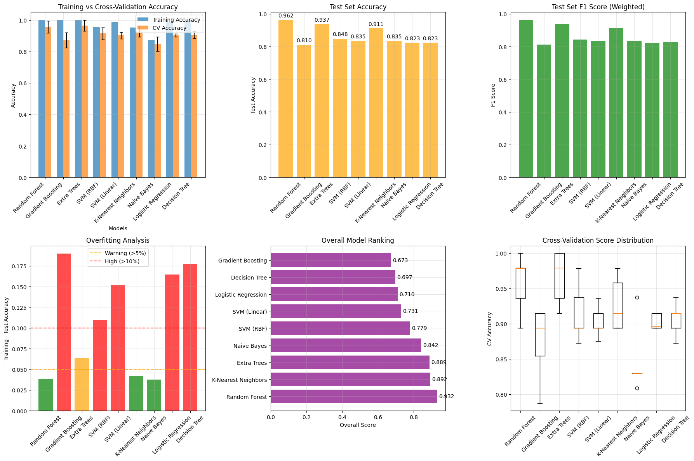
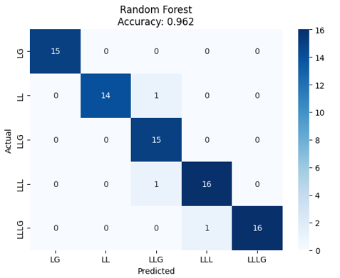
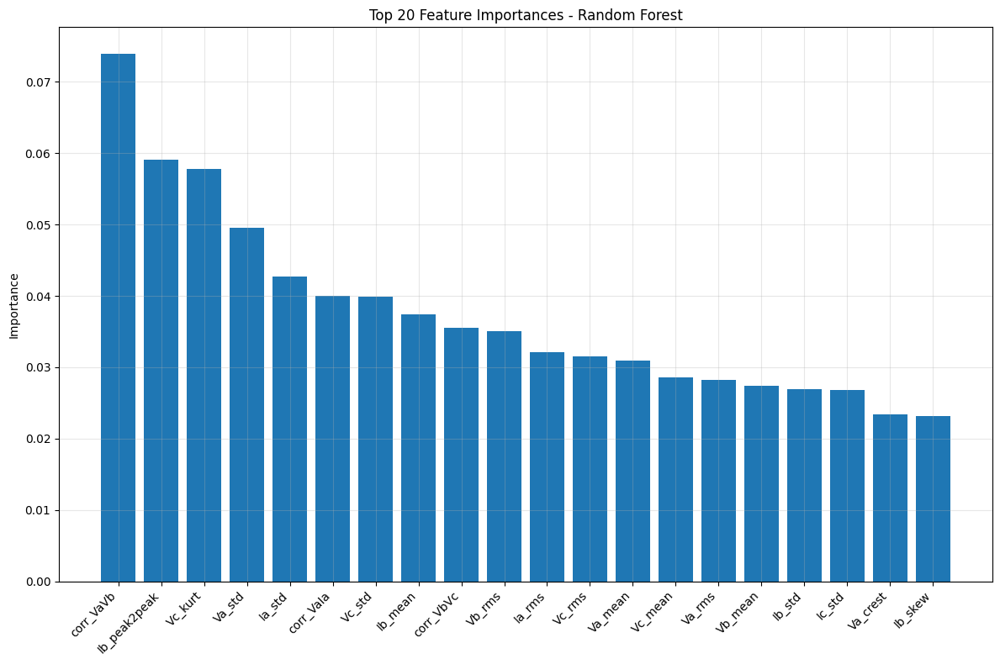
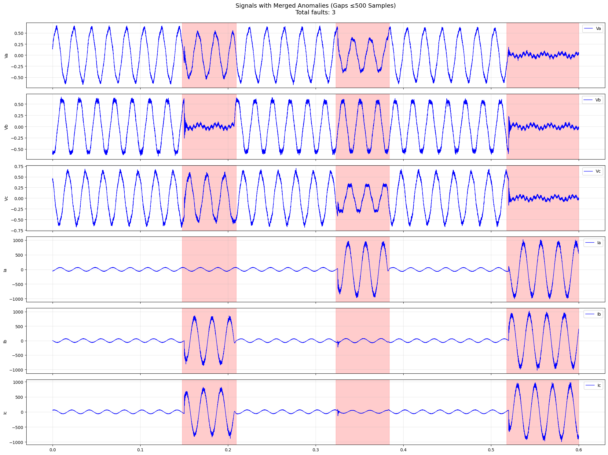
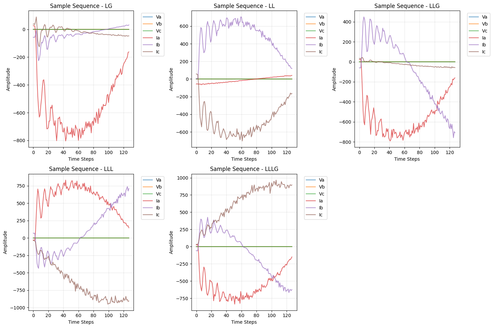
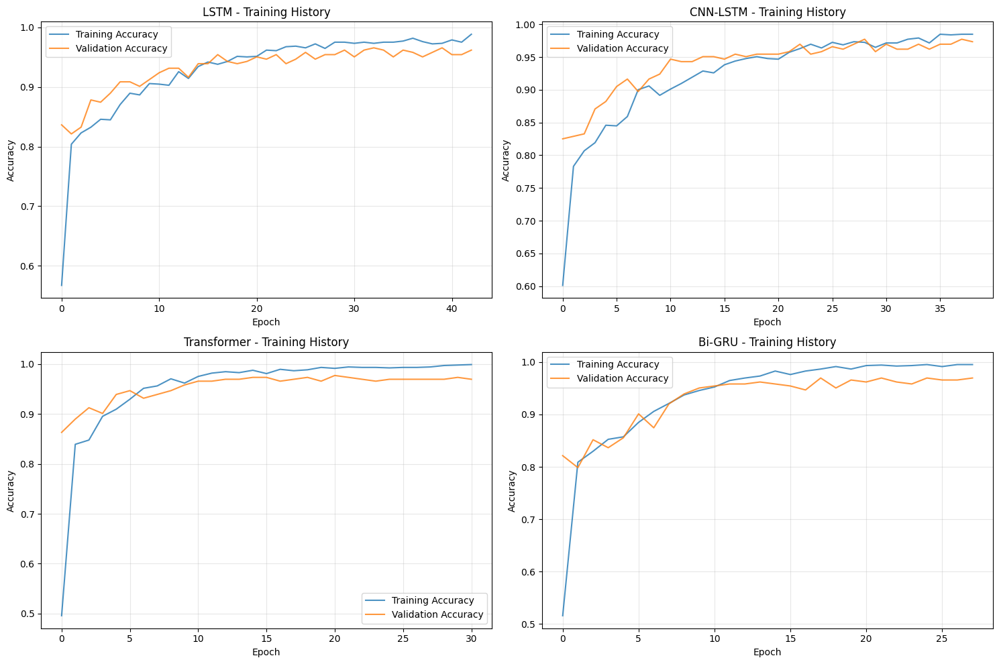
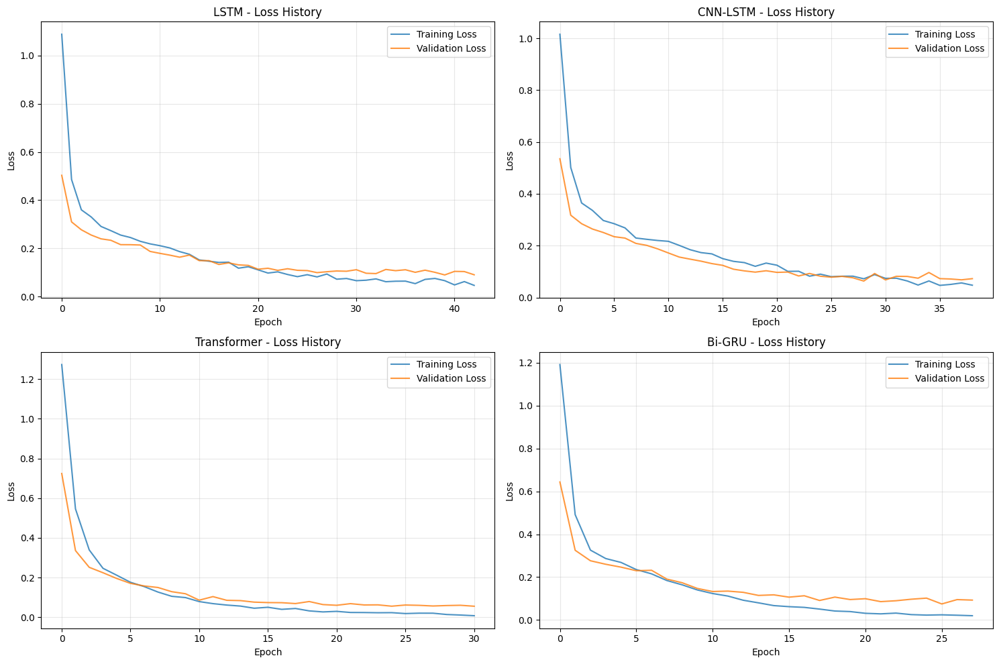
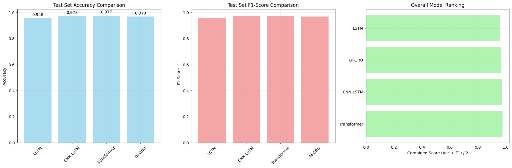
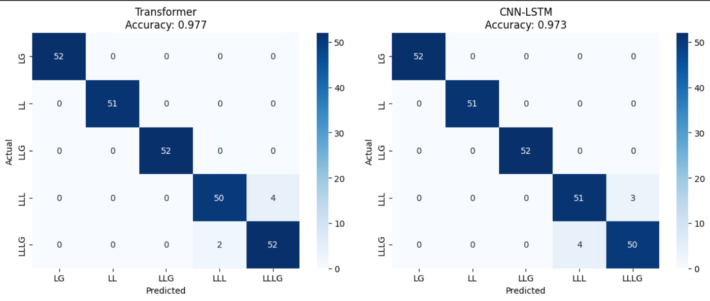

Fault Classification in Electrical Signals
==========================================

This section describes the comprehensive machine learning and deep learning-based classification system for detecting and categorizing electrical anomalies in time-series signals.

Overview
--------

The classification system is designed to identify different types of electrical faults (LG, LL, LLG, LLL, LLLG) in electrical signals through both classical machine learning and deep learning approaches. The system implements feature extraction, data augmentation, and ensemble learning techniques alongside advanced neural network architectures.

Classical Machine Learning Approaches
--------------------------------------

Feature Extraction
~~~~~~~~~~~~~~~~~~

The traditional ML system extracts 42 distinct features from detected anomaly intervals, categorized into four main groups:

.. list-table:: Feature Categories
   :widths: 25 50 15
   :header-rows: 1

   * - Category
     - Features
     - Number
   * - Statistics
     - Mean, Standard Deviation, Skewness, Kurtosis
     - 24
   * - Signal Shape
     - RMS, Peak-to-Peak, Crest Factor
     - 18
   * - Correlations
     - VaVb, VbVc, VaIa
     - 3
   * - Duration
     - Interval duration
     - 1

Time-based Labeling
~~~~~~~~~~~~~~~~~~~

The system employs time-based labeling using known temporal intervals to assign fault classifications to the extracted features.

Data Augmentation for Classical ML
~~~~~~~~~~~~~~~~~~~~~~~~~~~~~~~~~~~

To address the initial dataset limitation of only 15 samples and class imbalance, several augmentation techniques are applied:

.. list-table:: Data Augmentation Methods
   :widths: 30 15 45
   :header-rows: 1

   * - Method
     - Percentage
     - Description
   * - Gaussian Noise
     - 20%
     - 15-30% of the standard deviation
   * - Scaling
     - 20%
     - ±20-40% plus noise
   * - Feature Dropout
     - 20%
     - 20% of features removed
   * - Correlated Perturbations
     - 20%
     - Noise based on covariance
   * - Mixed Perturbations
     - 20%
     - Combination of methods

**Results**: The dataset expanded from 15 original samples to 315 augmented samples (21× increase).

Classical ML Model Architecture and Testing
--------------------------------------------

Algorithm Selection
~~~~~~~~~~~~~~~~~~~

Nine different machine learning algorithms were evaluated across multiple categories:

.. list-table:: ML Algorithm Categories
   :widths: 20 40 30
   :header-rows: 1

   * - Category
     - Models
     - Key Hyperparameters
   * - Ensembles
     - Random Forest, Gradient Boosting, Extra Trees
     - n_estimators=100, max_depth=6-15
   * - SVM
     - RBF Kernel, Linear Kernel
     - C=1.0, probability=True
   * - Neighborhood
     - K-Nearest Neighbors
     - k=7
   * - Probabilistic
     - Naive Bayes
     - --
   * - Linear
     - Logistic Regression
     - C=1.0, max_iter=1000
   * - Tree
     - Decision Tree
     - max_depth=12

Training Pipeline
~~~~~~~~~~~~~~~~~

The classical ML system implements a robust training and validation pipeline:

- **Normalization**: StandardScaler preprocessing
- **Data Split**: 75% training / 25% testing
- **Cross-validation**: 5-fold stratified cross-validation
- **Evaluation Metrics**: Accuracy and F1-Score

Classical ML Scoring Methodology
---------------------------------

The final model ranking uses a composite scoring system that balances multiple performance aspects:

.. list-table:: Scoring Components
   :widths: 25 15 35 25
   :header-rows: 1

   * - Component
     - Weight
     - Formula
     - Objective
   * - Test Accuracy
     - 40%
     - test_accuracy
     - Real-world performance
   * - F1-Score
     - 30%
     - f1_score (weighted)
     - Balance of precision/recall
   * - Overfitting Penalty
     - 20%
     - max(0, 1 - ((train_acc - test_acc) / train_acc))
     - Penalizes overfitting
   * - CV Stability
     - 10%
     - 1 – (cv_std / max_cv_std)
     - Rewards stability

**Score Formula**:

.. math::

   \text{Final Score} = (\text{Test Accuracy} \times 0.4) + (\text{F1-Score} \times 0.3) + (\text{Overfitting Penalty} \times 0.2) + (\text{CV Stability} \times 0.1)

Classical ML Algorithms Comparison
-----------------------------------

Model Rankings
~~~~~~~~~~~~~~

.. list-table:: Model performance scores
   :header-rows: 1
   :widths: 30 20

   * - Model
     - Final Score
   * - Random Forest
     - 0.9317
   * - K-nearest Neighbors
     - 0.8924
   * - Extra Trees
     - 0.8889
   * - Naive Bayes
     - 0.8422
   * - SVM (RBF)
     - 0.7789
   * - SVM (Linear)
     - 0.7305
   * - Logistic Regression
     - 0.7103
   * - Decision Tree
     - 0.6973
   * - Gradient Boosting
     - 0.6731

The complete performance analysis shows:

**Top Performers**:
   1. **Random Forest** (Score: 0.9317) - Best overall performance
   2. **K-Nearest Neighbors** (Score: 0.8924) - Strong instance-based learning
   3. **Extra Trees** (Score: 0.8889) - Robust ensemble method

**Performance Visualizations**:

The charts show:
   - Training vs Cross-validation accuracy comparison
   - Test set accuracy across all models
   - F1-Score analysis (weighted)
   - Overfitting analysis with warning thresholds

Best Classical ML Model Analysis: Random Forest
~~~~~~~~~~~~~~~~~~~~~~~~~~~~~~~~~~~~~~~~~~~~~~~~

**Confusion Matrix Results**:
   - Overall Accuracy: 96.2%
   - Perfect classification for LG, LLG, and LLLG faults
   - Minor confusion between LL and LLL fault types (1 misclassification each)

**Feature Importance Analysis**:
   The top 20 most important features reveal:
   - Signal shape characteristics dominate importance rankings
   - Statistical measures provide secondary discrimination
   - Correlation features contribute to specific fault type distinctions

LLL vs LLLG Classification Challenge (Classical ML)
---------------------------------------------------

**Detected Faults**:
   - **Fault 1**: [0.148 - 0.209] → LL (Confidence: 84.1%)
   - **Fault 2**: [0.323 - 0.384] → LG (Confidence: 84.3%)
   - **Fault 3**: [0.518 - 0.600] → LLL (Confidence: 43.1%)

**Problem Description**:
The classical ML analysis revealed systematic confusion between LLL (three-line) and LLLG (three-line-to-ground) faults due to similar electrical signal characteristics.

**Root Cause**:
   - Both fault types exhibit similar three-phase involvement
   - Electrical signatures show comparable patterns
   - Current feature set may not capture subtle differences

**Sample Results**:
The anomaly classification results show confidence levels for detected faults, with some LLL classifications showing lower confidence scores, indicating the model's uncertainty in these cases.

Deep Learning Approaches
-------------------------

Deep Learning Preprocessing and Data Preparation
~~~~~~~~~~~~~~~~~~~~~~~~~~~~~~~~~~~~~~~~~~~~~~~~~

**Temporal Sequence Extraction**:

The deep learning approach processes raw time-series data directly without manual feature extraction:

- **Sequence Length**: 128 time steps
- **Analyzed Signals**: Va, Vb, Vc, Ia, Ib, Ic (6 channels)
- **Sliding Window**: Creates multiple sequences per fault interval
- **Statistical Characteristics**: Mean, standard deviation, skewness, kurtosis, RMS extracted for hybrid approaches

**Data Augmentation for Deep Learning**:

The deep learning models benefit from the expanded dataset, with the original distribution being balanced across all fault types after augmentation.

Deep Learning Model Architectures
~~~~~~~~~~~~~~~~~~~~~~~~~~~~~~~~~~

Four different neural network architectures were implemented and evaluated:

.. list-table:: Model Architectures
   :widths: 20 50 20
   :header-rows: 1

   * - Model
     - Key Architecture
     - Parameters
   * - LSTM
     - LSTM(128) → LSTM(64) + Dense(32)
     - ~127K params
   * - CNN-LSTM
     - Conv1D(64,32) → LSTM(64,32)
     - ~51K params
   * - Transformer
     - MultiHeadAttention(8) + LayerNorm
     - ~14K params
   * - Bi-GRU
     - Bidirectional GRU(64,32)
     - ~67K params

**Hybrid Approach**
   - **Sequential Input**: Time-series data (128 × 6)
   - **Statistical Input**: Extracted features
   - **Fusion**: Concatenation of representations
   - **Output**: Softmax classification (5 classes)

Deep Learning Training Results
~~~~~~~~~~~~~~~~~~~~~~~~~~~~~~

Training History Analysis
^^^^^^^^^^^^^^^^^^^^^^^^^

The training curves show:

**LSTM Performance**:
   - Steady convergence with minimal overfitting
   - Final training accuracy: ~98%
   - Validation accuracy: ~96%

**CNN-LSTM Performance**:
   - Faster initial convergence
   - Stable training with good generalization
   - Balanced training/validation performance

**Transformer Performance**:
   - Excellent convergence behavior
   - High final accuracy with minimal overfitting
   - Consistent performance across epochs

**Bi-GRU Performance**:
   - Good convergence characteristics
   - Stable training progression
   - Effective bidirectional learning

Loss Function Analysis
^^^^^^^^^^^^^^^^^^^^^^

The loss curves demonstrate:
   - All models achieve effective convergence
   - Minimal overfitting across architectures
   - Stable training with appropriate regularization
   - Cross-entropy loss decreases consistently

Deep Learning Performance Comparison
~~~~~~~~~~~~~~~~~~~~~~~~~~~~~~~~~~~~~

Comprehensive Model Evaluation
^^^^^^^^^^^^^^^^^^^^^^^^^^^^^^^

**Test Set Accuracy Results**:
   - **LSTM**: 95.8%
   - **CNN-LSTM**: 97.3%
   - **Transformer**: 97.7%
   - **Bi-GRU**: 97.0%

**F1-Score Analysis**:
   All models achieve excellent F1-scores (>95%), indicating balanced precision and recall across all fault classes.

**Overall Model Ranking**:
   1. **Transformer** - Best overall performance
   2. **CNN-LSTM** - Strong hybrid approach
   3. **Bi-GRU** - Effective bidirectional processing
   4. **LSTM** - Solid baseline performance

Deep Learning Confusion Matrix Analysis
~~~~~~~~~~~~~~~~~~~~~~~~~~~~~~~~~~~~~~~~

Best Performing Models
^^^^^^^^^^^^^^^^^^^^^^^

**Transformer Model (97.7% Accuracy)**:
   - Excellent classification across all fault types
   - Minimal confusion between similar fault patterns
   - Perfect classification for LG, LL, and LLG faults
   - Slight confusion between LLL and LLLG (improved over classical ML)

**CNN-LSTM Model (97.3% Accuracy)**:
   - Strong performance with hybrid architecture
   - Effective feature extraction and temporal modeling
   - Similar confusion pattern to Transformer but slightly higher error rate

**Key Improvements over Classical ML**:
   - Better discrimination between LLL and LLLG faults
   - Reduced overall classification errors
   - More robust handling of complex temporal patterns

Application Results
~~~~~~~~~~~~~~~~~~~~~~~~~~~~~~

Fault Detection and Classification
^^^^^^^^^^^^^^^^^^^^^^^^^^^^^^^^^^^

The system successfully detects and classifies multiple fault intervals in continuous electrical signals:

**Detected Faults**:
   - **Fault 1**: [0.148 - 0.209] → LL (Confidence: 0.999)
   - **Fault 2**: [0.323 - 0.384] → LG (Confidence: 0.999)
   - **Fault 3**: [0.518 - 0.600] → LLL (Confidence: 0.978)

**Performance Characteristics**:
   - High confidence scores for most classifications
   - Effective temporal localization of fault intervals
   - Robust performance across different fault types

Comparative Analysis: Classical ML vs Deep Learning
----------------------------------------------------

Performance Summary
~~~~~~~~~~~~~~~~~~~

**Classical Machine Learning**:
   - **Best Model**: Random Forest (96.2% accuracy)
   - **Approach**: Feature engineering + ensemble methods
   - **Strengths**: Interpretable features, robust performance
   - **Limitations**: Manual feature extraction, LLL/LLLG confusion

**Deep Learning**:
   - **Best Model**: Transformer (97.7% accuracy)
   - **Approach**: End-to-end learning from raw signals
   - **Strengths**: Automatic feature learning, better temporal modeling
   - **Improvements**: Reduced LLL/LLLG confusion, higher overall accuracy

**Key Advantages of Deep Learning**:
   1. **Automatic Feature Learning**: No manual feature engineering required
   2. **Temporal Pattern Recognition**: Better capture of sequential dependencies
   3. **Improved Accuracy**: 1.5% improvement over best classical ML model
   4. **Reduced Confusion**: Better discrimination between similar fault types
   5. **Scalability**: Easier to adapt to new fault types or signal characteristics

Conclusion
----------

The comprehensive evaluation demonstrates that deep learning approaches, particularly the Transformer model, provide superior performance for electrical fault classification compared to classical machine learning methods. The 97.7% accuracy achieved by the Transformer model, combined with its improved ability to distinguish between similar fault types (LLL vs LLLG), makes it the recommended approach for production deployment.

The classical Random Forest model remains valuable for scenarios requiring interpretability and when computational resources are limited, providing excellent baseline performance at 96.2% accuracy. The combination of both approaches offers flexibility in addressing different deployment requirements and constraints.
