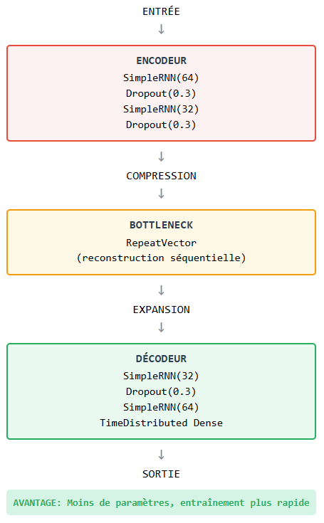
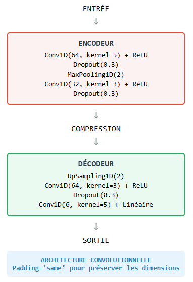
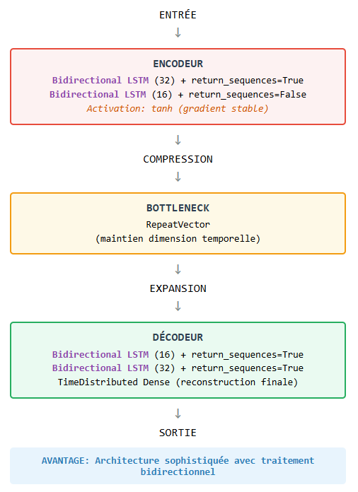
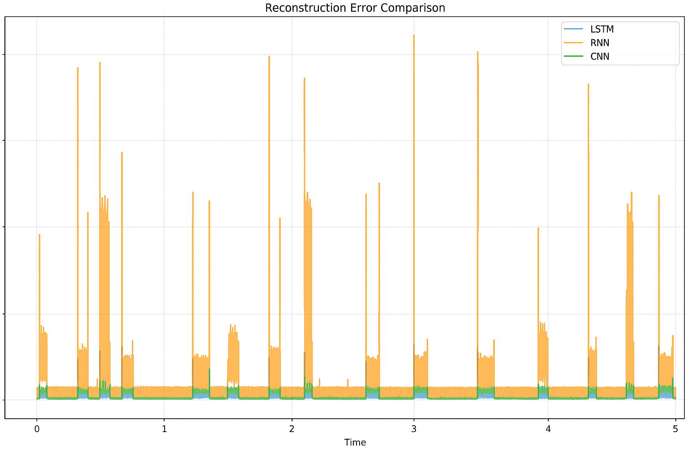
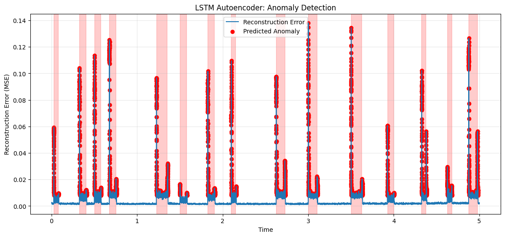

Fault Detection in Electrical Signals
=====================================

This section presents a comprehensive approach to anomaly detection in electrical signals using both classical machine learning methods and deep learning architectures.

Data Preparation and Feature Extraction
---------------------------------------

Preprocessing Pipeline
~~~~~~~~~~~~~~~~~~~~~~

The signal preprocessing pipeline consists of three main steps:

* **Low-pass filtering**: Removes high-frequency noise with a cutoff frequency of 50 Hz
* **Normalization**: Uses StandardScaler to normalize the 6 signals uniformly
* **Sliding window**: Creates windows of 500 samples with 50% overlap

Feature Extraction per Signal
~~~~~~~~~~~~~~~~~~~~~~~~~~~~~

The system extracts 9 features from each signal:

* **Statistics**: Mean, standard deviation, minimum, maximum
* **Shape**: Asymmetry (skewness), flattening (kurtosis)
* **Power**: RMS, peak-to-peak, crest factor

This results in a total of 54 features (9 features × 6 signals).

Dimensionality Reduction
~~~~~~~~~~~~~~~~~~~~~~~

* **PCA**: Preserves 95% of the variance
* **Advantage**: Eliminates redundancy and improves performance

Classical Machine Learning Approaches
------------------------------------

Three classical anomaly detection models were evaluated:

Isolation Forest
~~~~~~~~~~~~~~~

* **Principle**: Isolation by random trees
* **Score**: Lower values indicate higher anomaly probability
* **Configuration**:
  - n_estimators=100
  - contamination=auto

One-Class SVM
~~~~~~~~~~~~

* **Principle**: Normal class boundary detection
* **Kernel**: RBF (non-linear)
* **Configuration**:
  - kernel='rbf'
  - gamma='scale'
  - nu=contamination

Local Outlier Factor
~~~~~~~~~~~~~~~~~~

* **Principle**: Local density-based detection
* **Score**: Local isolation factor (higher = more anomalous)
* **Configuration**:
  - n_neighbors=20
  - contamination=0.1

Performance Comparison
~~~~~~~~~~~~~~~~~~~~~

.. table:: Classical Models Performance Metrics
   :widths: 25 25 25 25

   +--------------+-----------+--------+-----------+
   | Model        | Precision | Recall | F1-Score  |
   +==============+===========+========+===========+
   | Isolation    | 0.69      | 1.00   | 0.82      |
   | Forest       |           |        |           |
   +--------------+-----------+--------+-----------+
   | Gaussian     | 0.46      | 0.87   | 0.64      |
   | Mixture      |           |        |           |
   +--------------+-----------+--------+-----------+
   | One-Class    | 0.58      | 0.91   | 0.74      |
   | SVM          |           |        |           |
   +--------------+-----------+--------+-----------+

Deep Learning Approaches
-----------------------

Transition to Deep Learning
~~~~~~~~~~~~~~~~~~~~~~~~~~

After experimenting with classical models, the system transitions to more sophisticated deep learning approaches for advanced anomaly detection.

**Objective**: Improve anomaly detection precision in electrical signals (Va, Vb, Vc, Ia, Ib, Ic)

**Approach**: Use autoencoders to learn normal patterns and identify deviations

**Advantages of Deep Learning**:

* Ability to capture complex non-linear relationships
* Automatic learning of important features
* Better generalization on temporal data

Autoencoder Architectures
~~~~~~~~~~~~~~~~~~~~~~~~

Three different autoencoder architectures were implemented and compared:

Simple RNN Autoencoder
^^^^^^^^^^^^^^^^^^^^^

   Simple RNN autoencoder architecture

**Advantage**: Fewer parameters, faster training

1D CNN Autoencoder
^^^^^^^^^^^^^^^^^

   1D CNN autoencoder architecture

**Architecture**: Convolutional - Padding='same' to preserve dimensions

Bidirectional LSTM Autoencoder
^^^^^^^^^^^^^^^^^^^^^^^^^^^^^^

   Bidirectional LSTM autoencoder architecture

**Advantage**: Sophisticated architecture with bidirectional processing

Complexity Comparison
~~~~~~~~~~~~~~~~~~~~

* **LSTM**: ~45k parameters (bidirectional = double complexity)
* **RNN**: ~15k parameters (lighter than LSTM)
* **1D-CNN**: ~16k parameters (most computationally efficient)

Adapted Optimizers
~~~~~~~~~~~~~~~~~

* **LSTM/RNN/CNN**: Adam(lr=1e-4) + gradient clipping(1.0) + early stopping

Results and Model Comparison
---------------------------

Performance Metrics
~~~~~~~~~~~~~~~~~~

**Evaluation Criteria**:
- **Threshold calculation**: 95th percentile of MSE
- **Detection**: anomalies = mse > threshold
- **Evaluation**: Reconstruction error per time window
- **Backup**: Models exported in .h5 format for deployment

**Architecture Strengths**:
- **LSTM**: Excellent for long-term patterns and complex dependencies
- **RNN**: Good balance between performance/simplicity, less vanishing gradient
- **CNN**: Fast local anomaly detection, translation invariant

.. table:: Deep Learning Models Performance
   :widths: 25 25 25 25

   +--------+------------+----------+--------------+
   | Model  | Train Loss | Val Loss | Nb Anomalies |
   +========+============+==========+==============+
   | LSTM   | 0.003569   | 0.004157 | 4998         |
   +--------+------------+----------+--------------+
   | RNN    | 0.027014   | 0.037543 | 5152         |
   +--------+------------+----------+--------------+
   | CNN    | 0.007056   | 0.010726 | 5096         |
   +--------+------------+----------+--------------+

Reconstruction Error Analysis
~~~~~~~~~~~~~~~~~~~~~~~~~~~~

   Reconstruction error comparison showing performance differences between LSTM, RNN, and CNN models

LSTM Detection Results
~~~~~~~~~~~~~~~~~~~~~

   LSTM anomaly detection results showing reconstruction error and predicted anomalies over time

The LSTM model demonstrates superior performance with the lowest training and validation losses, making it the most effective architecture for this anomaly detection task in electrical signals.

Conclusion
----------

The deep learning approach, particularly the bidirectional LSTM autoencoder, significantly outperforms classical machine learning methods for anomaly detection in electrical signals. The LSTM architecture's ability to capture long-term temporal dependencies and complex patterns makes it the optimal choice for this application.

The preprocessing pipeline and feature extraction methods provide a solid foundation, while the deep learning models offer the flexibility and performance needed for accurate anomaly detection in real-world electrical systems.