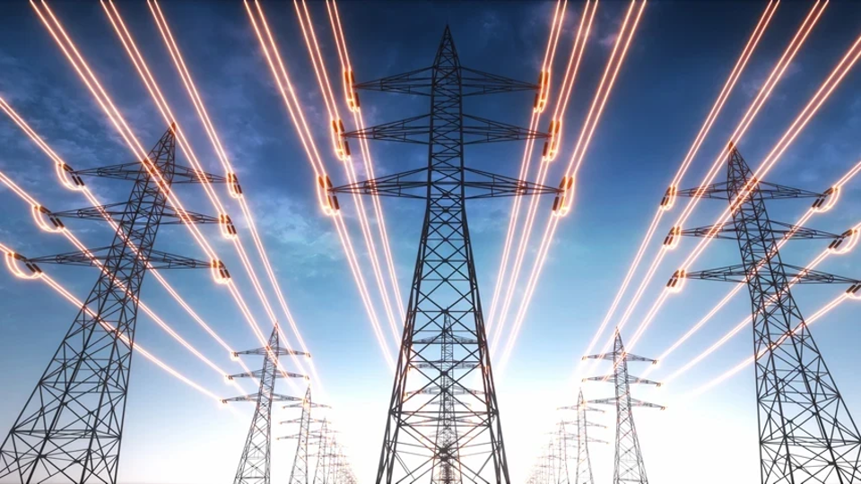

=====================================
PowerAI: Power System Fault Detection
=====================================

|

PowerAI is an advanced AI solution for detecting and classifying faults in electrical power systems using machine learning and deep learning techniques.

Project Information
===================

**Institution:** ENSAM-Meknes

**Field of Study:** GIATD

**Project Period:** [01/2025] - [06/2025]

**Supervisor:** Pr. Tawfik Masrour

Team Members
============

**Team Member 1:** Amine FARIS

**Team Member 2:** Abderrahman ESSAFI

Project Overview
================

PowerAI addresses the critical need for intelligent fault detection in modern power systems. As electrical grids become increasingly complex and interconnected, traditional fault detection methods often fall short in identifying subtle anomalies and emerging fault patterns. This project leverages cutting-edge artificial intelligence techniques to provide real-time, accurate, and interpretable fault detection capabilities.

**Problem Statement**

Power system faults can lead to equipment damage, service interruptions, and safety hazards. Early detection and accurate classification of these faults are essential for maintaining grid stability and reliability.

**Solution Approach**

Our AI-driven solution combines advanced signal processing with deep learning models to automatically detect, classify, and analyze power system anomalies in real-time, providing operators with actionable insights and early warning capabilities.

Key Features
============

- **Real-time Anomaly Detection:** Advanced autoencoder neural networks continuously monitor power system signals to identify deviations from normal operation patterns
- **Intelligent Fault Classification:** Automatic categorization of detected anomalies into specific fault types (short circuits, ground faults, equipment failures, etc.)
- **Interactive Monitoring Dashboard:** Comprehensive web-based interface for real-time visualization of system status, detected faults, and historical trends
- **Feature Importance Analysis:** Advanced analytics to understand fault signatures and identify the most critical indicators for different fault types
- **Multi-signal Processing:** Comprehensive analysis of voltage and current measurements across multiple phases and system components

Contents
========

.. toctree::
   :maxdepth: 2
   :caption: User Guide

   introduction
   installation
   data_acquisition
   fault_detection
   fault_classification
   dashboard
   nlpqueryinterface

Get Started
===========

To get started with PowerAI, follow the :doc:`installation guide <installation>` and check out the :doc:`usage examples <usage>`.